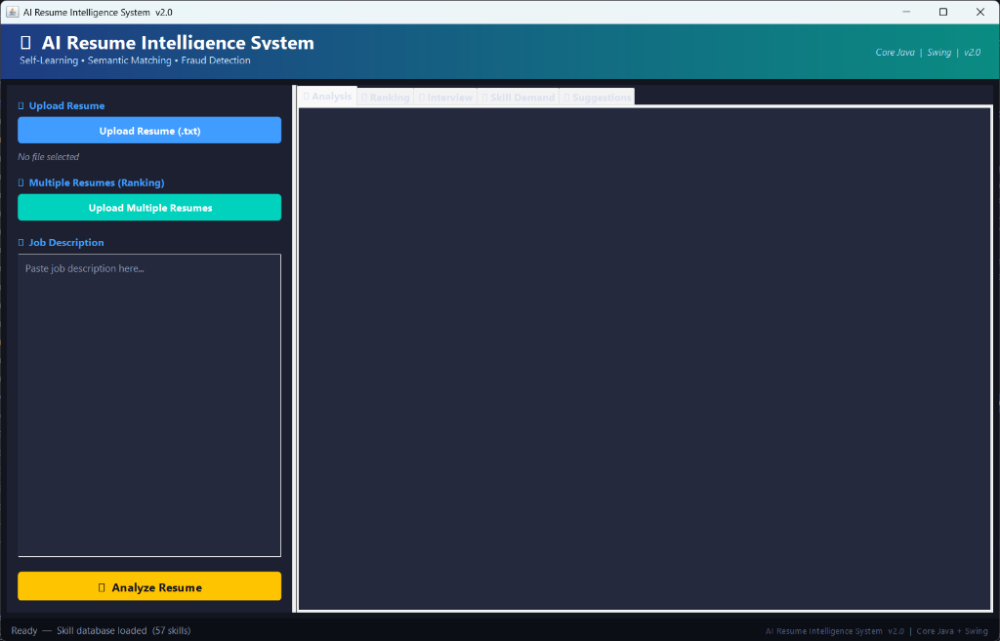
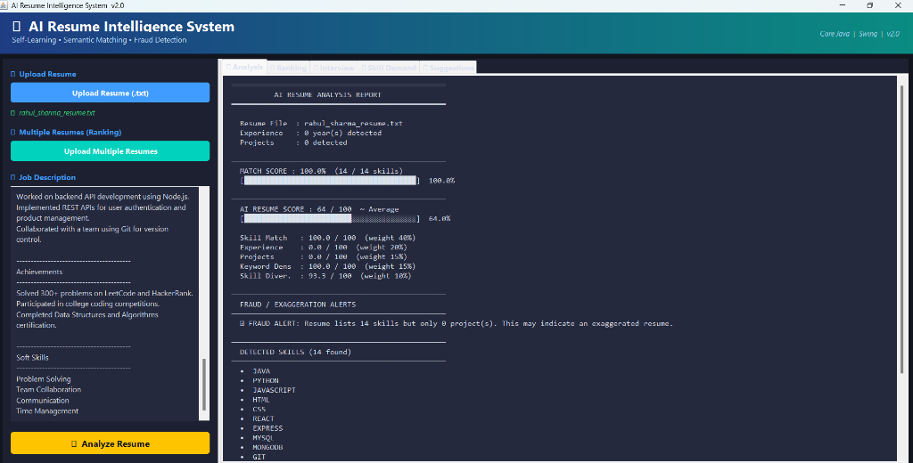

# 🤖 AI Resume Intelligence System v2.0

| Core Java + Java Swing | No External Libraries

A **GUI-based Self-Learning Resume Intelligence System** built entirely in Core Java and Swing. It analyzes resumes against job descriptions using manual NLP algorithms, semantic matching, AI scoring, and auto-learns new skills over time — functioning as a mini **ATS (Applicant Tracking System)**.

---

## 📸 Screenshots

### Main Interface



### Live Analysis Results



> *Real analysis: 100% match score, 14 skills detected, 5-factor AI score breakdown, Fraud Detection alert, and full skill listing — all in real time.*

---

## ✨ Features

| # | Feature | Description |
|---|---|---|
| 1 | **Swing GUI** | Dark-themed, gradient header, 5 result tabs |
| 2 | **Resume Upload** | `JFileChooser` — single or multiple `.txt` files |
| 3 | **Dynamic Skill Database** | Skills loaded from `skills.txt` at runtime |
| 4 | **Self-Learning AI** | Unknown tokens auto-added to skill DB at frequency ≥ 3 |
| 5 | **Semantic Matching** | Root-word partial matching (e.g. `spring` ↔ `springboot`) |
| 6 | **5-Factor AI Scoring** | Skill Match + Experience + Projects + Keyword Density + Diversity |
| 7 | **Fraud Detection** | Flags exaggerated resumes with too many skills vs. experience |
| 8 | **Resume Ranking** | Upload multiple resumes → sorted leaderboard table |
| 9 | **Interview Questions** | Auto-generates one question per detected skill |
| 10 | **Skill Demand Analyzer** | Counts skill mention frequency in the job description |

---

## 🏗️ Project Structure

```
java/
├── Main.java                    ← Entry point — launches Swing GUI
├── ResumeAnalyzerGUI.java       ← Full Swing window (5 result tabs)
├── SkillLearner.java            ← Dynamic skill DB + self-learning
├── SkillExtractor.java          ← Skill matching against database
├── TextProcessor.java           ← NLP preprocessing (tokenize, clean)
├── JobAnalyzer.java             ← Job description parser + demand map
├── SimilarityCalculator.java    ← Exact + semantic skill matching
├── ResumeScoringAI.java         ← 5-factor weighted AI scoring model
├── ResumeRanker.java            ← Multi-resume sorting & ranking
├── FraudDetector.java           ← Rule-based exaggeration detection
├── InterviewQuestionGenerator.java ← Skill → interview question map
├── SuggestionEngine.java        ← Resume improvement suggestions
├── ResumeReader.java            ← File I/O for resume text files
├── skills.txt                   ← External skill database (auto-updated)
├── resume.txt                   ← Sample resume
├── job.txt                      ← Sample job description
└── README.md
```

---

## 🧠 AI Scoring Formula

```
AI Resume Score =
    0.40 × Skill Match Score      (how many JD skills found in resume)
  + 0.20 × Experience Score       (years of experience detected)
  + 0.15 × Project Score          (number of projects listed)
  + 0.15 × Keyword Density Score  (JD keyword frequency in resume)
  + 0.10 × Skill Diversity Score  (breadth of technology coverage)
```

All sub-scores are normalised to 0–100 before weighting. Final score is on a **0–100 scale**.

---

## 🕵️ Fraud Detection Rules

The system flags suspicious resumes using heuristic rules:

```
Rule 1: skillCount > projectCount × 3  →  "Possible exaggerated resume"
Rule 2: yearsExp == 0 AND skillCount > 15  →  "No experience but high skill count"
Rule 3: skillCount ≥ 10 AND matchPercent < 30%  →  "Skills appear irrelevant"
```

---

## 🔁 Self-Learning Algorithm

```
For each analyzed resume / job description:
  1. Tokenize all words
  2. Skip known skills and common stop-words
  3. Count frequency of remaining tokens
  4. If token appears ≥ 3 times → append to skills.txt
  5. Show: "✨ New skill learned: <token>" in status bar
```

---

## ⚙️ How to Compile & Run

### Prerequisites
- Java 8 or higher (JDK)
- All `.java` and `.txt` files in the **same directory**

### Compile
```bash
javac *.java
```

### Run
```bash
java Main
```

The Swing window will open immediately.

---

## 🖥️ GUI Usage Guide

1. **Click "Upload Resume (.txt)"** → select your resume file
2. **Paste job description** into the text area
3. **Click "🔍 Analyze Resume"** → results appear across 5 tabs:

| Tab | Content |
|---|---|
| 📊 **Analysis** | Match %, AI Score, score breakdown, detected/missing skills, fraud warnings |
| 🏆 **Ranking** | Upload multiple resumes → ranked leaderboard by AI score |
| 🎤 **Interview** | One interview question generated per detected skill |
| 📈 **Skill Demand** | Most-mentioned skills in the job description |
| 💡 **Suggestions** | Personalised resume improvement tips |

---

## 📊 Sample Output

```
══════════════════════════════════════════════════
          AI RESUME ANALYSIS REPORT
══════════════════════════════════════════════════

  Resume File  : rahul_sharma_resume.txt
  Experience   : 0 year(s) detected
  Projects     : 0 detected

  MATCH SCORE : 100.0%  (14 / 14 skills)
  [████████████████████████████████████████]  100.0%

  AI RESUME SCORE : 64 / 100  ~ Average
  [████████████████████░░░░░░░░░░░░░░░░░░░]  64.0%

  Skill Match   : 100.0 / 100  (weight 40%)
  Experience    :   0.0 / 100  (weight 20%)
  Projects      :   0.0 / 100  (weight 15%)
  Keyword Dens  : 100.0 / 100  (weight 15%)
  Skill Diver.  :  93.3 / 100  (weight 10%)

⚠ FRAUD ALERT: Resume lists 14 skills but only 0 project(s).

  DETECTED SKILLS (14 found)
  •  JAVA  •  PYTHON  •  JAVASCRIPT  •  HTML  •  CSS
  •  REACT  •  EXPRESS  •  MYSQL  •  MONGODB  •  GIT  ...
```

---

## 🧩 Technologies Used

| Technology | Purpose |
|---|---|
| **Core Java** | All business logic, algorithms, data structures |
| **Java Swing** | GUI — `JFrame`, `JPanel`, `JTabbedPane`, `JFileChooser`, `JTable` |
| **File I/O** | Reading resumes, reading/writing `skills.txt` |
| **Collections** | `ArrayList`, `HashMap`, `HashSet`, `LinkedHashMap` |
| **Algorithms** | Tokenization, frequency counting, root-word matching, weighted scoring |

---

## 👨‍💻 Author

**Nihal Kumar Singh**
Engineering — Computer Science
*AI-Powered Resume Intelligence System using Core Java*

---

## 📄 License

This project is developed for academic purposes as a Demonstration Project.
